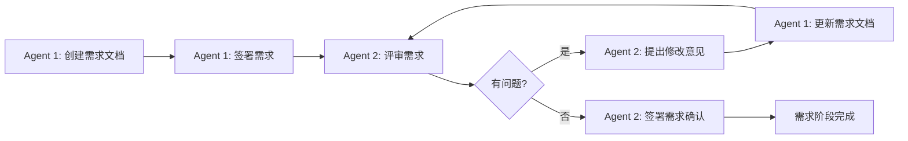
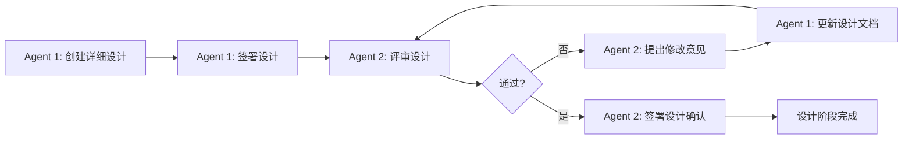
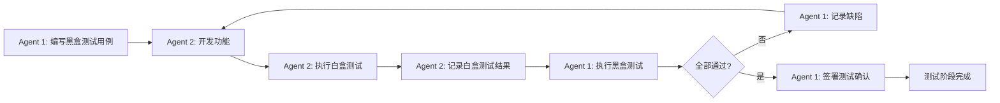

# 双Agent协作框架 - 使用手册

## 目录
1. [概述](#1-概述)
2. [在现有项目中使用](#2-在现有项目中使用)
3. [在新项目中使用](#3-在新项目中使用)
4. [CLI 命令参考](#4-cli-命令参考)
5. [工作流程](#5-工作流程)
6. [常见问题](#6-常见问题)

---

## 1. 概述

双Agent协作框架是一个用于软件开发的协作工具，通过分离产品经理（Agent 1）和开发（Agent 2）的职责，实现结构化的需求管理、设计评审、测试和部署流程。

### 核心功能
- **角色分离**：产品经理负责需求、测试、签署；开发负责实现、评审、白盒测试
- **规范化评审**：需求和设计都需要经过对方评审确认
- **签署机制**：每个阶段需要双方签署确认
- **状态跟踪**：自动跟踪项目进度和签署状态
- **知识传承**：所有评审意见和测试结果都有记录

### 适用场景
- 需要明确分离产品经理和开发职责的项目
- 需要严格评审流程的项目
- 需要完整审计记录的项目
- 需要跨团队协作的项目

---

## 2. 在现有项目中使用

### 2.1 快速开始

```bash
# 1. 进入现有项目目录
cd /path/to/your-existing-project

# 2. 初始化协作框架
oc-collab init .

# 3. 查看状态
oc-collab status
```

### 2.2 初始化后的目录结构

框架会在项目中创建以下目录和文件：

```
your-project/
├── docs/
│   ├── 01-requirements/      # 需求文档
│   ├── 02-design/            # 设计文档
│   ├── 03-test/              # 测试文档
│   ├── 04-changelog/         # 变更记录
│   └── COLLABORATION_GUIDE.md # 协作指南
├── state/
│   └── project_state.yaml    # 项目状态文件
├── .gitignore                # Git忽略文件
└── pyproject.toml            # 项目配置（如果是Python项目）
```

### 2.3 从哪个阶段开始？

根据项目当前进度，选择合适的起点：

| 项目阶段 | 建议操作 |
|---------|---------|
| 需求尚未明确 | 从需求阶段开始：`oc-collab init .` |
| 需求已明确，需要评审 | 进入设计阶段：创建设计文档 |
| 设计已完成，需要评审 | 进入开发阶段：`oc-collab switch 2` |
| 代码已完成，需要测试 | 进入测试阶段：编写黑盒测试用例 |

### 2.4 切换到开发模式

如果项目已经在开发中，可以让 Agent 2 直接开始：

```bash
# Agent 2 初始化并切换角色
oc-collab init .
oc-collab switch 2

# 查看当前状态
oc-collab status
```

### 2.5 集成到现有Git仓库

框架会自动检测并使用现有的 Git 仓库：

```bash
cd your-project
oc-collab init . --no-git  # 如果不想初始化Git
# 或
oc-collab init .           # 自动使用现有仓库
```

---

## 3. 在新项目中使用

### 3.1 创建新项目

```bash
# 方法1：使用框架创建项目
oc-collab init MyNewProject

# 方法2：在空目录中初始化
mkdir MyNewProject
cd MyNewProject
oc-collab init .
```

### 3.2 项目类型选择

框架支持自动检测项目类型：

```bash
# 自动检测（推荐）
oc-collab init MyProject --type auto

# 手动指定
oc-collab init MyProject --type python
oc-collab init MyProject --type typescript
oc-collab init MyProject --type mixed
```

**检测规则**：
| 类型 | 检测依据 |
|-----|---------|
| Python | pyproject.toml、setup.py、requirements.txt |
| TypeScript | package.json、tsconfig.json |
| Mixed | 同时存在多种语言特征 |

### 3.3 完整工作流程

```
1. 项目初始化
   └── oc-collab init ProjectName

2. 需求阶段（Agent 1）
   ├── 创建需求文档
   ├── 创建系统设计
   ├── 签署需求

3. 评审阶段（Agent 2）
   ├── 评审需求和设计
   ├── 提出修改意见
   ├── 签署确认

4. 设计阶段（Agent 1）
   ├── 创建详细设计
   ├── 评审详细设计
   └── 签署设计

5. 开发阶段（Agent 2）
   ├── 实现功能
   ├── 编写白盒测试
   └── 提交代码

6. 测试阶段（Agent 1 + Agent 2）
   ├── Agent 2：执行白盒测试
   ├── Agent 1：执行黑盒测试
   └── 签署测试确认

7. 部署阶段（Agent 1）
   ├── 更新变更记录
   ├── 创建版本标签
   └── 项目完成
```

### 3.4 协作开始

```bash
# 终端A - Agent 1（产品经理）
cd MyProject
oc-collab switch 1  # 切换到产品经理角色
oc-collab status    # 查看状态

# 终端B - Agent 2（开发）
cd MyProject
oc-collab switch 2  # 切换到开发角色
oc-collab status    # 查看状态
```

---

## 4. CLI 命令参考

### 4.1 init - 初始化项目

```bash
oc-collab init [PROJECT_NAME] [OPTIONS]
```

**选项**：
| 选项 | 说明 |
|-----|------|
| `--type, -t` | 项目类型：python/typescript/mixed/auto |
| `--force, -f` | 强制覆盖已存在的协作文件 |
| `--no-git` | 不初始化Git仓库 |

**示例**：
```bash
# 创建新项目
oc-collab init MyProject

# 在现有目录初始化
oc-collab init .

# 指定项目类型
oc-collab init MyProject --type python

# 覆盖已存在的文件
oc-collab init . --force
```

### 4.2 status - 查看状态

```bash
oc-collab status
```

**输出内容**：
- 项目名称
- 项目类型
- 当前阶段
- 当前Agent
- 签署状态

**示例**：
```bash
$ oc-collab status
项目状态
┏━━━━━━━━━━━┳━━━━━━━━━━━━━━━━━━━━━━━━━┓
┃ 项目      ┃ 值                      ┃
┡━━━━━━━━━━━╇━━━━━━━━━━━━━━━━━━━━━━━━━┩
│ 项目名称  │ MyProject               │
│ 项目类型  │ PYTHON                  │
│ 当前阶段  │ requirements_draft      │
│ 当前Agent │ Agent agent1 (产品经理) │
└───────────┴─────────────────────────┘
```

### 4.3 switch - 切换角色

```bash
oc-collab switch [AGENT_ID]
```

**参数**：
| AGENT_ID | 角色 |
|----------|------|
| 1 | 产品经理 |
| 2 | 开发 |

**示例**：
```bash
# 切换到开发角色
oc-collab switch 2

# 切换回产品经理角色
oc-collab switch 1
```

### 4.4 review - 评审管理

```bash
oc-collab review [TYPE] [OPTIONS]
```

**TYPE**：
| 类型 | 说明 |
|-----|------|
| requirements | 需求评审 |
| design | 设计评审 |
| test | 测试评审 |

**选项**：
| 选项 | 说明 |
|-----|------|
| `--new, -n` | 开始新的评审周期 |
| `--list, -l` | 列出所有评审记录 |

**示例**：
```bash
# 开始新的需求评审
oc-collab review requirements --new

# 列出评审历史
oc-collab review requirements --list

# 开始新的设计评审
oc-collab review design --new
```

### 4.5 signoff - 签署确认

```bash
oc-collab signoff [STAGE] [OPTIONS]
```

**STAGE**：
| 阶段 | 说明 |
|-----|------|
| requirements | 需求签署 |
| design | 设计签署 |
| test | 测试签署 |

**选项**：
| 选项 | 说明 |
|-----|------|
| `--comment, -m` | 签署意见 |

**示例**：
```bash
# 签署需求（带意见）
oc-collab signoff requirements --comment "需求清晰，同意开发"

# 签署设计
oc-collab signoff design --comment "设计合理"

# 签署测试通过
oc-collab signoff test --comment "所有测试用例通过"
```

### 4.6 history - 查看历史

```bash
oc-collab history
```

**示例**：
```bash
$ oc-collab history
协作历史:
  - 2026-01-31 15:00 Agent 1 签署测试确认
  - 2026-01-31 14:30 Agent 2 执行白盒测试
  - 2026-01-31 14:00 Agent 1 创建黑盒测试用例
  - ...
```

### 4.7 auto - 自动执行当前任务

```bash
oc-collab auto [OPTIONS]
```

**功能**：
- 自动检测当前阶段的任务
- 自动执行 Agent 的职责
- 自动推进阶段（满足条件时）
- 自动同步到 GitHub + Gitee

**选项**：
| 选项 | 说明 |
|-----|------|
| `--max-iterations, -n` | 最大迭代次数（默认 10） |
| `--quiet, -q` | 静默模式 |
| `--force, -f` | **强制执行，跳过本地变更检查**（用于守护进程） |

**示例**：
```bash
# 普通执行（会检查本地变更）
oc-collab auto

# 强制执行（守护进程使用）
oc-collab auto --force

# 指定迭代次数
oc-collab auto --max-iterations 5
```

### 4.7.1 Agent 自动执行守护进程

```bash
# 启动后台守护进程（每30秒检查一次）
nohup python3 scripts/agent_auto_runner.py \
    --path /path/to/project \
    --interval 30 > /tmp/agent_auto.log 2>&1 &

# 查看执行日志
tail -f /tmp/agent_auto.log

# 停止守护进程
pkill -f agent_auto_runner.py
```

### 4.7.2 自动执行的行为边界

**自动执行能做的：**
- ✓ 自动推进阶段（当条件满足时）
- ✓ 自动签署（当双方都确认时）
- ✓ 自动同步 Git 到所有平台
- ✓ 自动重试失败的 Git 操作

**自动执行不能做的：**
- ✗ 自动修复代码 bug（需要人类开发者）
- ✗ 自动执行黑盒测试（需要人类测试者）
- ✗ 自动做出设计决策（需要人类产品经理）

**示例：测试阶段的协作**

```
Agent 1 (产品经理):
  1. 手动执行黑盒测试
  2. 更新测试结果: oc-collab project update --type test --cases 22 --passed 15
  3. 签署: oc-collab signoff test --comment "15/22 通过"

Agent 2 (开发):
  1. 查看测试结果: oc-collab project status
  2. 手动修复问题（无法自动）
  3. 重新测试
  4. 更新测试结果
  5. 签署: oc-collab signoff test --comment "修复完成"

守护进程:
  - 自动检查阶段推进条件
  - 当双方签署后自动推进到 deployment
```

### 4.8 sync - 同步变更（支持智能重试）

```bash
oc-collab sync [OPTIONS]
```

**功能**：
- 拉取远程仓库的最新变更
- 支持智能重试，网络不稳定时自动重试
- 检测本地冲突

**选项**：
| 选项 | 说明 |
|-----|------|
| `--retry, -r` | 启用智能重试 |
| `--max-retries, -n` | 最大重试次数（默认 10） |
| `--interval, -i` | 重试间隔（秒，默认 30） |
| `--no-backoff` | 禁用指数退避 |

**示例**：
```bash
# 普通同步
oc-collab sync

# 启用智能重试（网络不稳定时）
oc-collab sync --retry

# 自定义重试参数
oc-collab sync --retry --max-retries 20 --interval 60
```

### 4.8 push - 推送代码（支持智能重试）

```bash
oc-collab push [OPTIONS]
```

**功能**：
- 提交并推送代码
- 支持智能重试和全平台同步
- 自动检测变更并提交

**选项**：
| 选项 | 说明 |
|-----|------|
| `--message, -m` | 提交信息（默认 "auto-sync: 更新"） |
| `--retry, -r` | 启用智能重试 |
| `--max-retries, -n` | 最大重试次数 |
| `--interval, -i` | 重试间隔（秒） |

**示例**：
```bash
# 普通推送
oc-collab push -m "feat: 新增功能"

# 带智能重试的推送
oc-collab push --retry -m "feat: 新增功能"
```

### 4.9 docs - 自动同步文档

```bash
oc-collab docs [ACTION] [OPTIONS]
```

**ACTION**：
| 操作 | 说明 |
|-----|------|
| check | 检查需要更新的文档 |
| preview | 预览待更新内容 |
| apply | 应用文档更新 |

**选项**：
| 选项 | 说明 |
|-----|------|
| `--message, -m` | 提交信息 |
| `--auto` | 启用自动同步 |
| `--no-auto` | 禁用自动同步 |

**示例**：
```bash
# 检查需要更新的文档
oc-collab docs check

# 预览文档更新
oc-collab docs preview

# 应用文档更新
oc-collab docs apply -m "docs: 更新文档"

# 启用自动文档同步
oc-collab docs apply --auto -m "feat: 新功能"
```

### 4.10 remote - 远程仓库管理

```bash
oc-collab remote [ACTION] [NAME] [URL]
```

**ACTION**：
| 操作 | 说明 |
|-----|------|
| list | 列出所有远程仓库 |
| add | 添加远程仓库 |
| push-all | 推送到所有远程仓库 |

**示例**：
```bash
# 列出所有远程仓库
oc-collab remote list

# 添加 Gitee 远程仓库
oc-collab remote add gitee https://gitee.com/yourname/project.git

# 推送到所有远程仓库
oc-collab remote push-all
```

### 4.9 sync-all - 一键全平台同步

```bash
oc-collab sync-all [OPTIONS]
```

**功能**：
- 提交本地变更
- 推送到所有配置的远程仓库（GitHub + Gitee）

**选项**：
| 选项 | 说明 |
|-----|------|
| `--message, -m` | 提交信息 |

**示例**：
```bash
# 一键同步到所有平台（GitHub + Gitee）
oc-collab sync-all -m "feat: 新增功能"

# 使用默认提交信息
oc-collab sync-all
```

**典型工作流**：
```bash
# 1. 添加 Gitee 远程仓库
oc-collab remote add gitee https://gitee.com/yourname/project.git

# 2. 查看远程仓库列表
oc-collab remote list
# 输出：
#   origin - https://gitee.com/yourname/project.git
#   github - https://github.com/yourname/project.git

# 3. 开发完成后，一键同步
oc-collab sync-all -m "feat: 完成功能开发"
```

### 4.10 help - 帮助信息

```bash
oc-collab --help          # 查看所有命令
oc-collab init --help     # 查看特定命令帮助
```

---

## 5. 工作流程

### 5.1 需求评审流程



**操作步骤**：
```bash
# Agent 1
oc-collab switch 1
# 创建 docs/01-requirements/requirements_v1.md
oc-collab signoff requirements --comment "需求已创建"

# Agent 2
oc-collab switch 2
oc-collab sync
# 阅读需求文档
# 创建 docs/01-requirements/requirements_review_v1.md
oc-collab signoff requirements --comment "评审通过"
```

### 5.2 设计评审流程



### 5.3 测试流程



### 5.4 状态转换

```
project_init
    │
    ├──> requirements_draft
    │         ├──> requirements_review
    │         ├──> requirements_approved
    │
    ├──> design_draft
    │         ├──> design_review
    │         ├──> design_approved
    │
    ├──> development
    ├──> testing
    ├──> deployment
    └──> completed
```

---

## 6. 常见问题

### Q1: 如何在两个终端中使用不同的Agent？

**解答**：在两个独立的终端中分别运行 `oc-collab switch 1` 和 `oc-collab switch 2`。

```bash
# 终端A - 产品经理
terminalA$ cd your-project
terminalA$ oc-collab switch 1
terminalA$ oc-collab status

# 终端B - 开发
terminalB$ cd your-project
terminalB$ oc-collab switch 2
terminalB$ oc-collab status
```

### Q2: 评审意见应该写在哪里？

**解答**：使用评审模板创建评审意见文件：

| 阶段 | 文件路径 |
|-----|---------|
| 需求评审 | `docs/01-requirements/requirements_review_v*.md` |
| 设计评审 | `docs/02-design/design_review_v*.md` |
| 测试评审 | `docs/03-test/test_review_v*.md` |

### Q3: 如何处理评审中的分歧？

**解答**：
1. 在评审意见中详细说明分歧点
2. 记录双方的论据
3. 可以暂时不签署，修改后重新评审
4. 必要时可以引入第三方仲裁

### Q4: 状态文件可以手动编辑吗？

**解答**：可以，但建议通过 CLI 命令修改。手动编辑时注意：
- 保持 YAML 格式正确
- 不要修改版本号字段
- 签署状态要双方同时签署才算有效

### Q5: 如何回退到之前的阶段？

**解答**：通过拒签机制回退：

```bash
# Agent 拒绝签署并说明原因
oc-collab signoff requirements --comment "需求不清晰，需要修改"
```

状态会自动回退到上一个阶段。

### Q6: 项目完成后如何归档？

**解答**：
1. 确保所有阶段都已签署
2. 更新变更记录：`docs/04-changelog/change_log.md`
3. 创建版本标签：
```bash
git tag -a v1.0.0 -m "版本发布说明"
git push origin main --tags
```

### Q7: 如何在CI/CD中使用？

**解答**：在 CI/CD 脚本中运行：

```bash
# 检查状态
oc-collab status

# 同步变更
oc-collab sync

# 执行测试（需要先初始化）
oc-collab init . --type python --no-git
pytest
```

### Q8: 忘记切换Agent怎么办？

**解答**：查看状态文件确认当前状态：

```bash
cat state/project_state.yaml | grep current_agent
```

如果发现角色错误，切换后再继续操作。

### Q9: Git冲突如何解决？

**解答**：使用 `sync` 命令：

```bash
oc-collab sync
```

如果冲突无法自动解决，手动解决后再提交。

### Q10: 如何迁移到新机器？

**解答**：
```bash
# 在新机器上
git clone https://gitee.com/your-name/your-project.git
cd your-project

# 重新安装CLI工具
pip install -e .

# 查看状态
oc-collab status
```

---

## 附录

### A. 文件命名规范

| 文件类型 | 命名模式 | 示例 |
|---------|---------|------|
| 需求文档 | `requirements_v{版本}.md` | requirements_v1.md |
| 系统设计 | `system_design_v{版本}.md` | system_design_v1.md |
| 详细设计 | `detailed_design_v{版本}.md` | detailed_design_v1.md |
| 评审意见 | `{类型}_review_v{版本}.md` | requirements_review_v1.md |
| 签署确认 | `{类型}_signoff.md` | requirements_signoff.md |
| 黑盒用例 | `blackbox_test_cases.md` | blackbox_test_cases.md |
| 白盒结果 | `whitebox_test_results.md` | whitebox_test_results.md |
| 变更记录 | `change_log.md` | change_log.md |

### B. Git标签规范

| 阶段 | 标签格式 | 示例 |
|-----|---------|------|
| 需求确认 | `requirements-v{版本}` | requirements-v1 |
| 设计确认 | `design-v{版本}` | design-v1 |
| 测试通过 | `test-v{版本}` | test-v1 |
| 发布版本 | `v{主}.{次}.{修订}` | v1.0.0 |

### C. 状态文件字段说明

```yaml
phase: 当前阶段  # project_init / requirements_* / design_* / development / testing / deployment / completed

requirements:
  version: 版本号      # v1, v2...
  pm_signoff: true/false  # 产品经理签署状态
  dev_signoff: true/false # 开发签署状态
  status: 状态          # draft / review / approved
  review_cycles: 评审轮次

design:
  # 同上结构

test:
  blackbox_cases: 黑盒用例数
  whitebox_passed: 白盒通过数
  blackbox_passed: 黑盒通过数
  status: 状态          # pending / in_progress / passed

development:
  status: 状态          # pending / in_progress / completed
  branch: 分支名

deployment:
  status: 状态
  version: 版本号
```

---

## 版本信息

- **版本**: 1.2.0
- **更新日期**: 2026-01-31
- **作者**: 双Agent协作框架团队

**更新内容**：
- v1.2.0: 新增智能重试机制 (`sync --retry`, `push --retry`) 和自动文档同步 (`docs`)
- v1.1.0: 新增 `remote` 和 `sync-all` 命令，支持 GitHub + Gitee 双平台同步
- v1.0.0: 初始版本，发布核心功能

---

**使用过程中遇到问题？请查看 [常见问题](#6-常见问题) 或联系项目维护者。**
